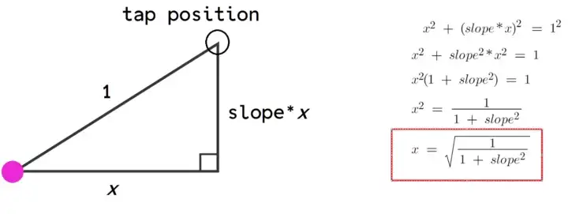
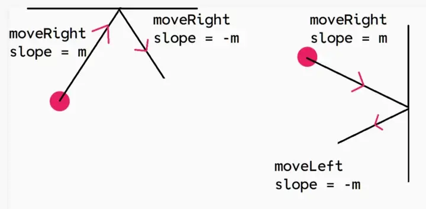

# animated_square

Create a flutter app that contains a square in the middle containing an image. The square starts to move
in the direction of the first swipe and keeps bouncing off the walls of the page. The direction of the
movement can be changed with further swipes. If the square is clicked at any point while moving, the
image changes to another random image which should be loaded from the internet

# how we solve
We used cubit to manage background image change when we tap on container and responsive image quality on different screens size.

After searching through the internet and animation cookbooks an answer found that I managed to optimize it for presented problem.

In order to get the position of where we swap we use [GestureDetector] widget with `onPanUpdate` and `onPanEnd` properties.

To make the ball move to where we tap on the screen, we first need to find the slope between where the dot currently is on the screen and where we tapped.

Given two points with coordinates x1, y1 and x2, y2, the slope between them is given by the formula (y2-y1)/(x2-x1). HOWEVER, since the y-coordinate increases as you move down the screen (which is the opposite of a normal graph in math class), we’ll have to change the signs of the y-coordinates.

How do we make the dot bounce off the edges?
If the ball is moving right, it can bounce off of the top, bottom, or right side. If it bounces off the top or bottom, it will keep moving right but with the slope changing signs. If it bounces off the right, it’ll move left with the slope changing signs.

## Getting Started

This project is a starting point for a Flutter application.

A few resources to get you started if this is your first Flutter project:

- [Lab: Write your first Flutter app](https://flutter.dev/docs/get-started/codelab)
- [Cookbook: Useful Flutter samples](https://flutter.dev/docs/cookbook)

For help getting started with Flutter, animated_container_feature.view our
[online documentation](https://flutter.dev/docs), which offers tutorials,
samples, guidance on mobile development, and a full API reference.
